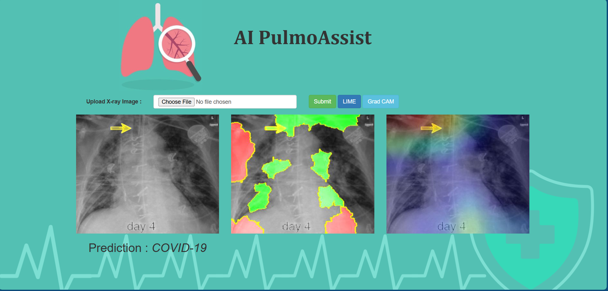

# 🫁 AI PulmoAssist  
### An Explainable AI Approach for Multi-Class Lung Disease Classification using Chest X-ray Images

AI PulmoAssist is a deep learning–based web application for **multi-class lung disease detection** from chest X-ray (CXR) images.  
The system combines **transfer learning**, **lung segmentation**, and **Explainable AI (XAI)** techniques to provide both **accurate predictions** and **visual explanations** for clinical decision support.

---

## 🚀 Key Features

- 🔍 **Multi-class classification** of lung diseases:
  - COVID-19  
  - Bacterial Pneumonia  
  - Viral Pneumonia  
  - Tuberculosis  
  - Normal
- 🧠 **Transfer Learning models**:
  - VGG16  
  - VGG19  
  - ResNet50  
  - InceptionV3
- 🫁 **Lung segmentation** using U-Net to improve model focus
- 🧩 **Explainable AI (XAI)**:
  - LIME (Local Interpretable Model-Agnostic Explanations)
  - Grad-CAM (Gradient-weighted Class Activation Mapping)
- 🌐 **Web-based interface** for uploading X-ray images and visualizing predictions

---

## 🖥️ Application Output

Below is a sample output of the AI PulmoAssist system showing:
- Original Chest X-ray  
- LIME explanation  
- Grad-CAM heatmap  
- Final disease prediction  

---

## 🧠 System Architecture & Workflow

1. **Input**: Chest X-ray image  
2. **Preprocessing**:
   - Resizing to 256 × 256
   - Data augmentation (zoom, flip)
3. **Lung Segmentation**:
   - Pre-trained U-Net with VGG encoder
4. **Classification**:
   - Transfer learning models (VGG16, VGG19, ResNet50, InceptionV3)
5. **Explainability**:
   - LIME for local feature importance
   - Grad-CAM for visual attention maps
6. **Output**:
   - Disease class prediction
   - Interpretable visual explanations

---

## 📊 Dataset Details

- **Source**: Kaggle  
- **Classes**: 5  
- **Image size**: 256 × 256  
- **Formats**: JPG, JPEG, PNG  

| Class                  | Images |
|------------------------|--------|
| COVID-19               | 1218   |
| Bacterial Pneumonia    | 1205   |
| Viral Pneumonia        | 1204   |
| Tuberculosis           | 1220   |
| Normal                 | 1204   |

🔗 Dataset Link:  
https://www.kaggle.com/datasets/omkarmanohardalvi/lungs-disease-dataset-4-types

---

## 🧪 Explainable AI Techniques

### 🔹 LIME
- Generates local perturbations of input images  
- Fits an interpretable model locally  
- Highlights regions influencing the prediction  

### 🔹 Grad-CAM
- Uses gradients from final convolutional layers  
- Produces class-specific heatmaps  
- Visualizes regions most responsible for predictions  

These explanations improve **model transparency**, **trust**, and **clinical interpretability**.

---

## 📈 Results Summary

- Improved classification accuracy with lung segmentation  
- Robust multi-class prediction performance  
- Clear visual explanations aligned with clinical regions of interest  

---

## 📄 Research Publication

This project has been **published in a peer-reviewed journal**:

> **An XAI Approach for Multi-Class Lung Disease Classification Using Transfer Learning with X-ray Images**  
> *Scientific Reports (Nature)*, 2025  

🔗 **Paper Link**:  
https://www.nature.com/articles/s41598-025-07603-4

---

## 🛠️ Tech Stack

- Python  
- TensorFlow / Keras  
- OpenCV  
- NumPy, Matplotlib  
- LIME  
- Flask (Web Interface)

---

> ⚠️ Disclaimer:  
This system is intended for **research and educational purposes only** and should not replace professional medical diagnosis.
